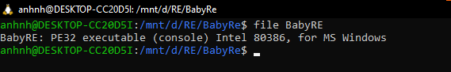
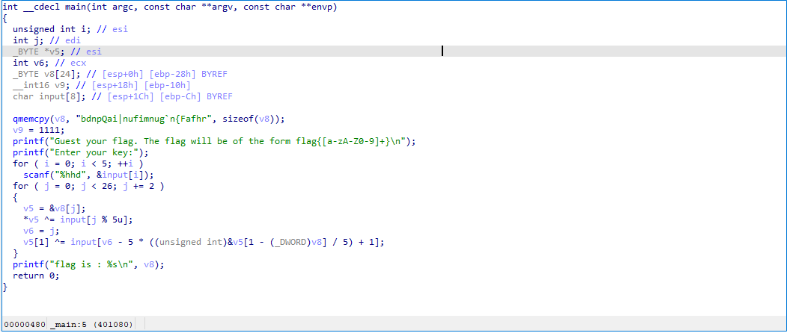
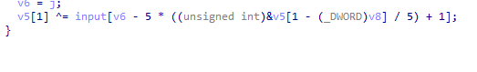
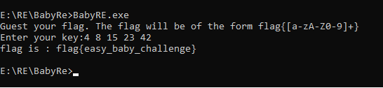

kiểm tra file thấy đây là file thực thi PE32 của windows



load file vào ida32
###IDA


-input nhập vào là 5 số với format của scanf là `%hhd` nên key sẽ là 5 số 1 byte 
sau khi nhập input thì chuỗi ` v8` `=` ``bdnpQai|nufimnug`n{Fafhr`` sẽ được biến đổi qua input 

-các ký tự chẵn của chuỗi `v8` sẽ được xor lặp 5 lần, lần lượt với key theo thứ tự `0 2 4 1 3`

-vì output là `printf("Guest your flag. The flag will be of the form flag{[a-zA-Z0-9]+}\n");` 
thì sẽ có 5 ký tự đầu của flag là `f` `l` `a` `g` `{`

-nên sẽ suy ra được 3 ký tự vị trí `0` `2` `4` của input là 3 số

```python
ord('b') ^ ord('f') =  4 
ord('n') ^ ord('a') = 15
ord('Q') ^ ord('{') = 42
```

-còn lại 2 ký vị trí `1` và `3` của key thì cũng thực hiện phép biến đổi thông qua phép xor nhưng phức tạp hơn
 
 
-tuy nhiên vì sử dụng phép xor nên có thể đoán được do đã có format của flag bằng cách xor ngược lại

```python
ord('l') ^ ord('d') =  8
ord('g') ^ ord('p') = 23
```
từ đây có được 5 số của key là `4` `8` `15` `23` `42`


`flag{easy_baby_challenge}`
