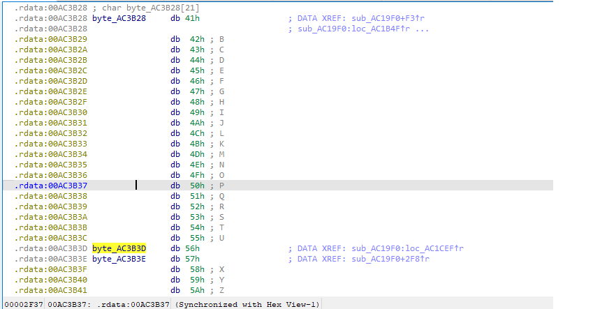
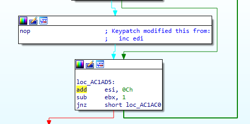
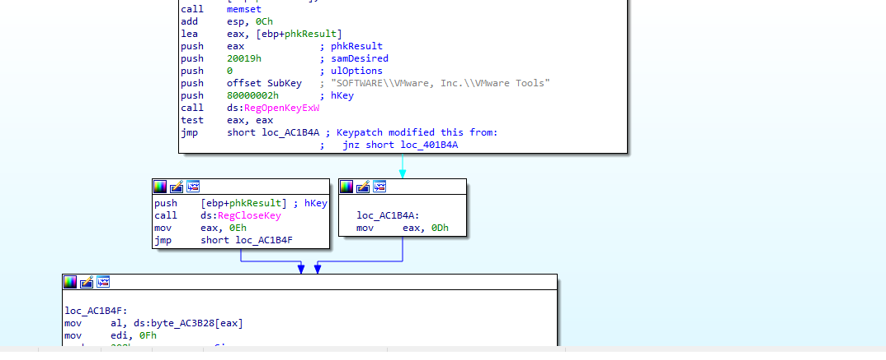
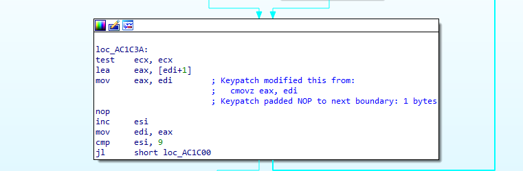
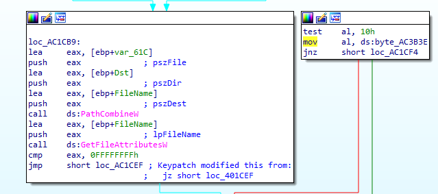
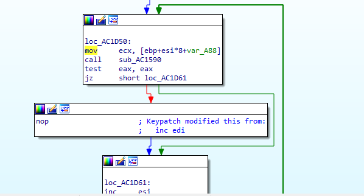
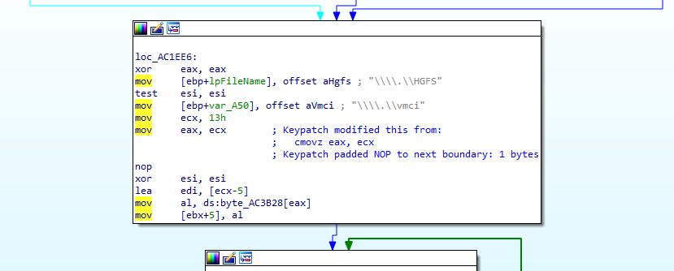
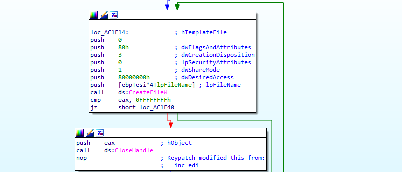
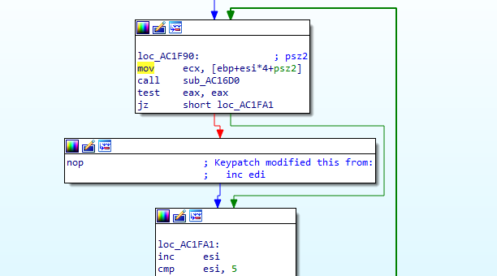
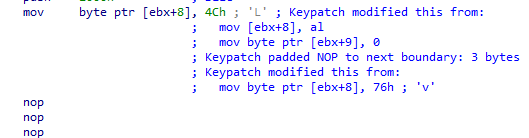

load file vào ida32
### IDA
- hàm main có 2 luồng thực thi với 1 luồng có hàm tham số `argc` của hàm main là `1` và `2`
- với `argc == 2` thì `argv[1]` sẽ là key cho thuật toán encrypt RC4 1 đoạn data 44 byte
- với `argc == 1` thì key cho thuật toán encrypt RC4 1 đoạn data 88 byte sẽ là trả về của hàm `sub_AC19F0`

#### hàm `sub_AC19F0` 
##### hàm `sub_AC19F0` kiểm tra những đặc điểm của `VMware` 
##### key của thuật toán với `argc == 1` được gen theo bảng chữ cái `byte_AC3B28`

- `key[0]` bị thay đổi bằng cách sử dụng api `RegOpenKeyExW` và `RegQueryValueExW` để check các registry của VMWare, patch lại phần này để có được `key[0] == byte_AC3B28[4]`

- `key[1]` gán giá trị `byte_AC3B28[13]` nếu không tại registry `SOFTWARE\\VMware, Inc.\\VMware Tools` và bằng `byte_AC3B28[14]` nếu tồn tại, bypass bằng cách cho `key[1]` luôn luôn bằng `byte_AC3B28[13]`

- `key[2]` bị thay đổi bằng cách check trong `system32` các dấu hiệu của VMware, path lại để có `key[2] == byte_AC3B28[15]`

- `key[3]` bị thay đổi bằng cách check xem có path `C:\Program Files (x86)\VMWare\` không, nếu có thì `key[3] == 87` còn không thì `key[3] == 86`, bypass bằng cách cho `key[3]` luôn luôn bằng `86`

- `key[4]` check địa chỉ MAC mặc định của VMware, patch lại phần này để có được `key[0] == byte_AC3B28[0]`

- `key[5]` sử dụng api `GetAdaptersInfo` để check nếu có bất kỳ adapter nào trong máy có chữ `VMWare` thì gán `key[5] == byte_AC3B28[0]`, không thì `key[5] == byte_AC3B28[19]`, bypass bằng cách cho `key[5]` luôn bằng `byte_AC3B28[19]` 

- `key[6]` bị thay đổi bằng cách check xem có 2 file `\\\\.\\HGFS` hoặc `\\\\.\\vmci` không, bypass bằng cách cho `key[6]` luôn bằng 14 theo luồng thực thi 

- `key[7]` bị thay đổi bằng cách sử dụng `CreateToolhelp32Snapshot` để check xem có các process của VMware không, bypass bằng cách cho `key[1]` luôn bằng 1 theo luồng thực thi 

- `key[8]` sử dụng `EnumSystemFirmwareTables` với `FirmwareTableProviderSignature là RSMB` để check xem có cụm từ `VMware` không, nếu có thì gán `key[8] == byte_AC3B28[11]`, không thì `key[8] == byte_AC3B28[10]`, có thể bypass bằng cách patch thằng `key[8] == 0x4C`(byte_AC3B28 == 0x4C)

#### debug ra được key hoàn chỉnh là `RACINGBOY`, decrypt RC4 ra được đoạn `Congratulation! Use this password to unlock the flag: BROKENVM (Pass it as argument)`

#### từ đây có được flag hoàn chỉnh `vcstraining{Running_in_VM_is_ridiculous}`