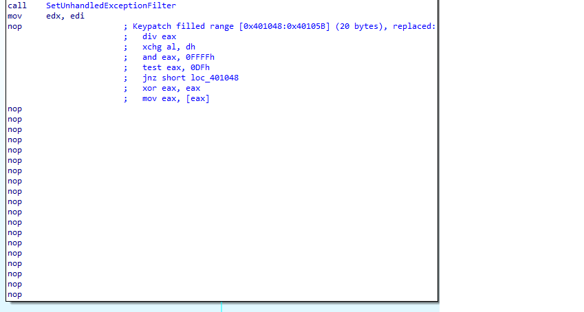

load file vào ida32
### IDA
- hàm main có 1 đoạn code xảy ra `exception divide by zero` và một đoạn code không hợp lệ nên để thực thi được phải patch 2 đoạn này bằng lệnh `nop`

#### hàm `DialogFunc` 
- phân tích callback function `DialogFunc` của `DialogBoxParamA` 

##### với message `WM_INITDIALOG`, luồng thực thi sẽ gặp 3 kỹ thuật anti-debug `IsDebuggerPresent`, `NtGlobalFlag` và `ProcessHeap` trong `PEB`
- để debug được chương trình cần patch 3 kỹ thuật này lại 
    + `IsDebuggerPresent` nhảy tới `ExitProcess` nếu sử dụng debugger  
    + `NtGlobalFlag` kiểm tra nếu khác 0 thì sẽ nhảy tới `ExitProcess`
    + `ProcessHeap` kiểm tra nếu `Flag` không có `HEAP_GROWABLE`(0x00000002) và nếu ForceFlags nếu khác 0 thì sẽ phát hiện debugger và nhảy tới `ExitProcess`  
        https://www.apriorit.com/dev-blog/367-anti-reverse-engineering-protection-techniques-to-use-before-releasing-software#p4
    + ngoài ra ở hàm `sub_401757` kiểm tra xem opcode từ `loc_4011AC` có bị thay đổi hay không, patch luôn hàm này để có thể patch code đoạn sau mà không bị `ExitProcess`

- patch bằng cách `nop` đoạn code nhảy tới ExitProcess của cả 3 kỹ thuật 

##### với message `WM_COMMAND`, luồng thực thi sẽ gặp kỹ thuật anti-debug sử dụng `NtQueryInformationProcess` với `ProcessInformationClass` là `ProcessDebugPort`
- `NtQueryInformationProcess`  sẽ chuyển `ProcessInformation` thành giá trị khác 0 nếu có debugger 
- nếu `ProcessInformation` có giá trị khác 0 thì opcode tại `loc_4010A4` sẽ bị thay đổi bằng cách cộng từng byte với giá trị trong `ProcessInformation`
- để debug được thì sau khi gọi hàm `NtQueryInformationProcess` thì sửa đổi giá trị trong `ProcessInformation` thành 0 để opcode trong `loc_4010A4` không đổi

- luồng thực thi tiếp theo là đến lời gọi hàm `sub_401284`

#### hàm `sub_401284`
##### luồng thực thi đầu tiên sẽ gặp 1 kỹ thuật anti-debug sử dụng `OutputDebugStringA` và `GetLastError`
- nếu chạy trên win vista trở xuống thì sẽ bị check debugger với 2 hàm `OutputDebugStringA` và `GetLastError` vì vậy có thể patch hoặc chạy trên windows phiên bản cao để bypass
- debug qua đoạn anti-debug sẽ thu được đoạn flag đầu tiên là `NtQu3ry1nf0rm@t10nPr0(355`

#### hàm `sub_40134F`
- kết thúc hàm trên patch đoạn `push offset loc_401323` thành `jmp offset loc_401323` để đến được phần thực thi của hàm `sub_40134F`
- hàm `sub_40134F` sử dụng kỹ thuật anti-debug `CheckRemoteDebuggerPresent` để check debug_port nếu bằng 1 thì jump đến đoạn `ExitProcess`, patch bằng cách nop đoạn jump đến `ExitProcess`
- debug qua đoạn anti-debug sẽ thu được đoạn flag thứ 2 là `NtQu3ry1nf0rm@t10nPr0(355R@!s33xc3pt!on`

#### hàm `loc_401391`
- đoạn code tiếp theo sử dụng kỹ thuật `CreateToolhelp32Snapshot` và `Process32Next` như link `https://anti-debug.checkpoint.com/techniques/misc.html#parent-process-check-createtoolhelp32snapshot` để check xem có debugger không, nếu có thì thoát chương trình 
- bypass bằng cách thay đổi giá trị so sánh của eax sau khi gọi hàm anti-debug thành `0FFFFFFFFh`
- debug tiếp thu được đoạn flag thứ 3 là `NtQu3ry1nf0rm@t10nPr0(355R@!s33xc3pt!onD3bugPr1v1l3g3`

#### `0040108C`
- tại offset `0040108C`, patch để instuction `jbe` làm cho `ZF == CF` để đến hàm `sub_4010C9`, debug ở đây để thu được đoạn còn lại của flag gồm 100 ký tự, từ đây đoán theo nghĩa flag thứ `4`, `5`, `6`, `7`, `8`, `9` là `NtQu3ry1nf0rm@t10nPr0(355R@!s33xc3pt!onD3bugPr1v1l3g3St@ckT1m3CCS3lf-P3BF1ndW1nd0wH1d1ng@nt1-R3v3rs3`

flag4: `NtQu3ry1nf0rm@t10nPr0(355R@!s33xc3pt!onD3bugPr1v1l3g3St@ckT1m3`
flag5: `NtQu3ry1nf0rm@t10nPr0(355R@!s33xc3pt!onD3bugPr1v1l3g3St@ckT1m3CC`
flag6: `NtQu3ry1nf0rm@t10nPr0(355R@!s33xc3pt!onD3bugPr1v1l3g3St@ckT1m3CCS3lf-P3B`
flag7: `NtQu3ry1nf0rm@t10nPr0(355R@!s33xc3pt!onD3bugPr1v1l3g3St@ckT1m3CCS3lf-P3BF1ndW1nd0w`
flag8: `NtQu3ry1nf0rm@t10nPr0(355R@!s33xc3pt!onD3bugPr1v1l3g3St@ckT1m3CCS3lf-P3BF1ndW1nd0wH1d1ng`
flag9: `NtQu3ry1nf0rm@t10nPr0(355R@!s33xc3pt!onD3bugPr1v1l3g3St@ckT1m3CCS3lf-P3BF1ndW1nd0wH1d1ng@nt1-R3v3rs3`
