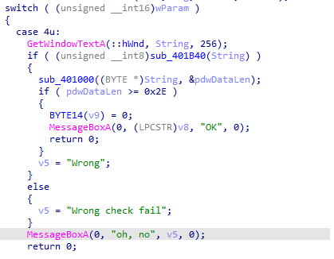

load file vào ida32
### IDA
- list function của IDA có 1 hàm `tlsCallback_0` được gọi trước khi hàm `WinMain` được gọi  
- hàm `tlsCallback_0` sử dụng `NtQueryInformationProcess` để anti debug bằng cách sửa byte thứ 10 tại mảng tại `byte_405018` thành `74h`


#### hàm `sub_401B40` 
- hàm `sub_401B40` xử lý input nhập vào  



- trước khi xử lý input, một mảng v25[556] được khởi tạo khi gọi hàm `sub_401FD0`.
- mảng v25[556] được khởi tạo với tham số là mảng tại `byte_405018` và mảng v25[556] là tham số thứ 2 cho hàm thực hiện encrypt từng ký tự.
- từ đây có thể suy ra tại `tlsCallback` nếu chạy trong debugger thì hàm encrypt sẽ thực hiện sai. Bypass bằng cách trong `tslCallback` bỏ qua đoạn sửa byte


##### hàm `encrypt` thực hiện trả về 38 ký tự để so sánh với input
- encrypt thực hiện với 7 case qua mảng `{6, 1, 7, 1, 3, 2, 4, 3, 6, 3, 7, 6, 1, 4, 7, 4, 1, 5, 7, 6, 7, 5, 6, 4, 5, 1, 7, 5, 2, 3, 1, 2, 3, 2, 1, 6, 2, 4}`
- encrypt sau khi trả về sẽ thực hiện xor với từng ký tự trong mảng `{14, 235, 243, 246, 209, 107, 167, 143, 61, 145, 133, 43, 134, 167, 107, 219, 123, 110, 137, 137, 24, 149, 103, 202, 95, 226, 84, 14, 211, 62, 32, 90, 126, 212, 184, 16, 194, 183}` 
- tham số thứ nhất của hàm `encrypt` là `0` hoặc `1` nên dựa vào đây để tìm ra key 


###### `case 1:`
- thực hiện anti debug bằng cách `and` giá trị của `NtGlobalFlag` [https://anti-debug.checkpoint.com/techniques/debug-flags.html#manual-checks-ntglobalflag](https://anti-debug.checkpoint.com/techniques/debug-flags.html#manual-checks-ntglobalflag), nếu có debugger thì tham số vào hàm `encrypt` sẽ là `1` nên truyền với tham số của `case 1` là `0`
###### `case 2:` và `case 3`
- anti debug bằng cách check trong Flags field như link [https://anti-reversing.com/Downloads/Anti-Reversing/The_Ultimate_Anti-Reversing_Reference.pdf](https://anti-reversing.com/Downloads/Anti-Reversing/The_Ultimate_Anti-Reversing_Reference.pdf)- trang 13, 2 trường hợp check trong nhiều phiên bản Windows khác nhau. Nếu có debugger thì tham số vào hàm `encrypt` sẽ là `0` nên truyền với tham số của `case 2` và `case 3` là `1`

###### `case 4:`
- sử dụng `HeapWalk` để xem cuối Heap có xuất hiện dãy `0xABABABAB` 2 lần trong cuối của Heap Block không [https://anti-debug.checkpoint.com/techniques/debug-flags.html](https://anti-debug.checkpoint.com/techniques/debug-flags.html), nếu có thì sẽ có debugger và tham số của `encrypt` sẽ gán là `0`, nên cần tham số truyền vào trong `case 4` là `1`

###### `case 5:` 
- sử dụng `CreateToolhelp32Snapshot` để snapshot lạ về process và `Process32Next` để loop qua từng process [https://anti-debug.checkpoint.com/techniques/misc.html#parent-process-check-createtoolhelp32snapshot](https://anti-debug.checkpoint.com/techniques/misc.html#parent-process-check-createtoolhelp32snapshot), nếu có debugger thì tham số vào hàm `encrypt` sẽ là `0` nên truyền với tham số của `case 5` là `1 

###### `case 6:`
- sử dụng `BlockInput` để phát hiện xem có debugger không bằng cách gọi 2 lần liên tiếp với tham số truyền vào là `TRUE`, nếu cả 2 trả về cùng là `TRUE` hoặc cùng là `FALSE` thì có debugger[https://anti-debug.checkpoint.com/techniques/interactive.html#blockinput](https://anti-debug.checkpoint.com/techniques/interactive.html#blockinput), để cả 2 `BlockInput` trả về giá trị không cùng nhau thì tham số vào hàm `encrypt` phải là 0.  

###### `case 7:`
- sử dụng `NtQueryInformationProcess` để check `ProcessDebugPort`, nếu có debugger thì tham số của `encrypt` là `1`, nên cần tham số truyền vào trong `case 4` là `0`


##### từ việc phân tích các trường hợp, có tham số của `encrypt` phù hợp là 
- case `1`, `4`, `5` == `0`
- case `2`, `3`, `6`, `7` == `1`


##### payload để lấy key sẽ là 


```C 
#include <Windows.h>
#include <stdio.h>


char shuffer[] = {9, 18, 15, 3, 4, 23, 6, 7, 8, 22, 10, 11, 33, 13, 14, 27, 16, 37, 17, 19, 20, 21, 5, 34, 24, 25, 26, 2, 12, 29, 30, 31, 32, 28, 0, 35, 36, 1};
char option[] = {6, 1, 7, 1, 3, 2, 4, 3, 6, 3, 7, 6, 1, 4, 7, 4, 1, 5, 7, 6, 7, 5, 6, 4, 5, 1, 7, 5, 2, 3, 1, 2, 3, 2, 1, 6, 2, 4};
char thamsothu3[] = {1, 3, 1, 1, 2, 1, 3, 1, 2, 2, 4, 4, 1, 3, 4, 4, 4, 1, 2, 1, 4, 1, 4, 3, 1, 2, 4, 4, 2, 2, 1, 3, 4, 2, 1, 2, 2, 3};
unsigned char enc[] = {14, 235, 243, 246, 209, 107, 167, 143, 61, 145, 133, 43, 134, 167, 107, 219, 123, 110, 137, 137, 24, 149, 103, 202, 95, 226, 84, 14, 211, 62, 32, 90, 126, 212, 184, 16, 194, 183};
unsigned char mem_arr[] = {54, 236, 0, 0, 54, 237, 0, 0, 54, 187, 0, 0, 54, 140, 0, 0, 0, 0, 0, 0, 0, 0, 0, 0, 0, 0, 0, 0, 0, 0, 0, 0, 95, 0, 0, 0, 108, 239, 153, 0, 25, 238, 225, 118, 0, 0, 0, 0, 0, 0, 0, 0, 0, 0, 0, 0, 0, 0, 0, 0, 0, 0, 0, 0, 0, 0, 0, 0, 0, 0, 0, 0, 0, 0, 0, 0, 0, 0, 0, 0, 0, 0, 0, 0, 0, 0, 0, 0, 0, 0, 0, 0, 0, 0, 0, 0, 0, 0, 0, 0, 0, 0, 0, 0, 0, 0, 0, 0, 0, 0, 0, 0, 0, 0, 0, 0, 0, 0, 0, 0, 0, 0, 0, 0, 0, 0, 0, 0, 0, 0, 0, 0, 0, 0, 0, 0, 0, 0, 0, 0, 0, 0, 0, 0, 0, 0, 0, 0, 0, 0, 0, 0, 0, 0, 0, 0, 0, 0, 0, 0, 0, 0, 0, 0, 0, 0, 0, 0, 0, 0, 0, 0, 0, 0, 0, 0, 0, 0, 0, 0, 0, 0, 0, 0, 0, 0, 0, 0, 0, 0, 0, 0, 0, 0, 0, 0, 0, 0, 0, 0, 0, 0, 0, 0, 0, 0, 0, 0, 0, 0, 0, 0, 0, 0, 0, 0, 0, 0, 0, 0, 0, 0, 0, 0, 0, 0, 0, 0, 0, 0, 0, 0, 0, 0, 0, 0, 0, 0, 0, 0, 0, 0, 0, 0, 0, 0, 0, 0, 0, 0, 0, 0, 0, 0, 0, 0, 0, 0, 0, 0, 0, 0, 0, 0, 0, 0, 0, 0, 0, 0, 0, 0, 0, 0, 0, 0, 0, 0, 0, 0, 0, 0, 0, 0, 0, 0, 0, 0, 0, 0, 0, 0, 0, 0, 0, 0, 0, 0, 0, 0, 0, 0, 0, 0, 0, 0, 0, 0, 0, 0, 0, 0, 0, 0, 0, 0, 0, 0, 0, 0, 0, 0, 0, 0, 0, 0, 0, 0, 0, 0, 0, 0, 0, 0, 0, 0, 0, 0, 0, 0, 0, 0, 0, 0, 0, 0, 0, 0, 0, 0, 0, 0, 0, 0, 0, 0, 0, 0, 0, 0, 0, 0, 0, 0, 0, 0, 0, 0, 0, 0, 0, 0, 0, 0, 0, 0, 0, 0, 0, 0, 0, 0, 0, 0, 0, 0, 0, 0, 0, 0, 0, 0, 0, 0, 0, 0, 0, 0, 0, 0, 0, 0, 0, 0, 0, 0, 0, 0, 0, 0, 0, 0, 0, 0, 0, 0, 0, 0, 0, 0, 0, 0, 0, 0, 0, 0, 0, 0, 0, 0, 0, 0, 0, 0, 0, 0, 0, 0, 0, 0, 0, 0, 0, 0, 0, 0, 0, 0, 0, 0, 0, 0, 0, 0, 0, 0, 0, 0, 0, 0, 0, 0, 0, 0, 0, 0, 0, 0, 0, 0, 0, 0, 0, 0, 0, 0, 0, 0, 0, 0, 0, 0, 0, 0, 0, 0, 0, 0, 0, 0, 0, 0, 0, 0, 0, 0, 0, 0, 0, 0, 0, 0, 0, 0, 0, 0, 0, 0, 0, 0, 0, 0, 0, 0, 0, 0, 0, 0, 0, 0, 0, 0, 0, 0, 0, 0, 0, 0, 0, 0, 0, 0, 0, 0, 0, 0, 0, 0, 0, 0, 0, 0, 0, 0, 0, 0, 0, 0, 0, 0, 0, 0, 0, 0, 0, 0};


char wtf_func(char a1, int a2, int a3)
{
  int v4; // esi
  char v6; // bl
  int v7; // ecx
  WORD v8; // dx
  unsigned int v9; // edx
  char v10; // cl
  unsigned int v11; // edx
  char v12; // al
  bool v13; // zf
  int v14; // ecx
  int v15; // esi
  char v16; // dl
  int v18; // [esp+14h] [ebp+8h]

  v4 = a3 - 1;
  v18 = 171;
  v6 = 0;
  do
  {
    if ( v4 <= 5 )
    {
      if ( *(DWORD *)(a2 + 4 * v4 + 16) )
        v8 = *(WORD *)(a2 + 4 * v4 + 16);
      else
        v8 = *(WORD *)(a2 + 4 * v4);
      v7 = (v8 >> 1) | (WORD)(((WORD)(32 * v8) ^ (v8 ^ (WORD)(4 * (v8 ^ (2 * v8)))) & 0xFFE0) << 10);
      *(DWORD *)(a2 + 4 * v4 + 16) = v7;
    }
    else
    {
      v7 &= 0XFFFF0000;
    }
    v9 = v7 & 0x7FF;
    v10 = v7 & 7;
    v11 = v9 >> 3;
    if ( a1 )
      v12 = *(BYTE *)(a2 + v11 + 44);
    else
      v12 = ~*(BYTE *)(a2 + v11 + 44);
    v13 = v18-- == 1;
    *(BYTE *)(a2 + v11 + 44) = v12 ^ (1 << v10);
  }
  while ( !v13 );
  v14 = a2 + 46;
  v15 = 64;
  do
  {
    v16 = *(BYTE *)(v14 - 2);
    v14 += 4;
    v6 ^= *(BYTE *)(v14 - 4) ^ *(BYTE *)(v14 - 3) ^ *(BYTE *)(v14 - 5) ^ v16;
    --v15;
  }
  while ( v15 );
  return v6;
}


int main()
{
    char key[39];
    char a;
    int i = 0;
    while (i < 38)
    {
        if(option[i] == 1 || option[i] == 4 || option[i] == 5)
            a = wtf_func(0, (int)&mem_arr,thamsothu3[i]);
        else 
            a = wtf_func(1, (int)&mem_arr,thamsothu3[i]);    

        key[shuffer[i]] = a ^ enc[i];
        i++;
    }
    printf("%s", key);
}

//key = I_10v3-y0U__wh3n Y0u=c411..M3 Senor1t4
//flag = vcstraining{Th3_U1tiM4t3_ant1_D3Bu9_ref3r3ncE}
```


