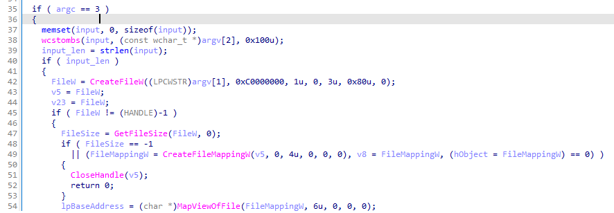
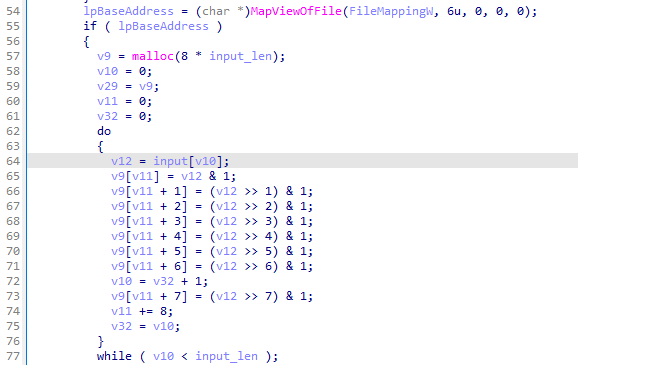
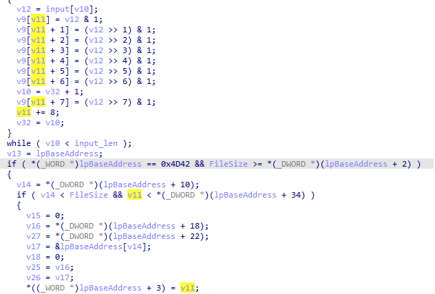
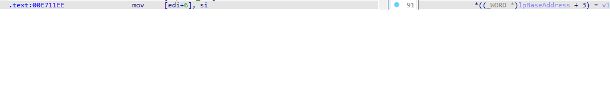
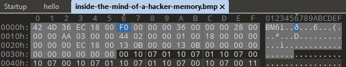
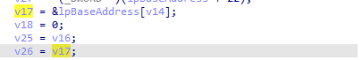
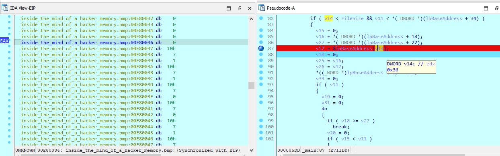
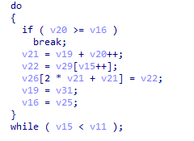

load file vào ida32
### IDA
hàm main của chương trình 

- hàm main yêu cầu input nhập vào là 2 tham số
    + tham số thứ nhất là tên file nhập để truyền vào hàm api `CreateFileW`
    + tham số thứ hai là input nhập vào 
hàm main thực hiện mở file với api `CreateFileW` để gọi api `MapViewOfFile` và thay đổi  
do có file ảnh `inside-the-mind-of-a-hacker-memory.bmp` nên tham số thứ nhất sẽ là `inside-the-mind-of-a-hacker-memory.bmp`

- sau khi thực hiện gọi `MapViewOfFile` thì input thực hiện dịch bit để chuyển về mỗi 8 số nhị phân như sau:


- đoạn code check độ dài của input sau khi chuyển nhị phân tối thiểu là 0xF0 




- đoạn code chèn từng byte `0/1` nhị phân từ input vào trong khoảng mỗi 3 byte một 




- từ đây có thể dump lại input ra từ file ảnh có sẵn 0xF0 byte `0/1`, mỗi byte cách nhau 3 byte 

``` python
a = []
extract = []
f = open("inside-the-mind-of-a-hacker-memory.bmp","rb")
data = f.read()

for i in range(54,54+720,3):
    a.append(data[i])
f.close()

for i in range(0,len(a),8):
    extract.append(''.join([str(x) for x in a[i:i+8]]))
```

#### extract = `['01100110', '00110110', '10000110', '11100110', '11011110', '00100110', '11110110', '01110110', '00101110', '11111010', '01100110', '11110110', '01001110', '11100110', '10100110', '00101110', '11111010', '00101110', '00010110', '10100110', '11111010', '00101110', '01001110', '10100110', '10000110', '11001110', '10101110', '01001110', '10100110', '10111110']`

cuối cùng chỉ cần brute-force lại dịch bit để lấy lại được flag trong ảnh 

``` python
a = []
extract = []
f = open("inside-the-mind-of-a-hacker-memory.bmp","rb")
data = f.read()

for i in range(54,54+720,3):
    a.append(data[i])
f.close()

for i in range(0,len(a),8):
    extract.append(''.join([str(x) for x in a[i:i+8]]))

def brute(a1):
    a = [0] * 8
    v11 = 0 
    for i in range(0x20, 0x7f):
        ii = bin(i) 
        aa = i
        a[v11] = aa & 1 
        a[v11 + 1] = (aa >> 1) & 1
        a[v11 + 2] = (aa >> 2) & 1
        a[v11 + 3] = (aa >> 3) & 1
        a[v11 + 4] = (aa >> 4) & 1
        a[v11 + 5] = (aa >> 5) & 1
        a[v11 + 6] = (aa >> 6) & 1
        a[v11 + 7] = (aa >> 7) & 1
        b = format(aa, '08b')
        c = a1
        if  b == c:
            #print(i)
            return i  

for i in extract:
    print(chr(brute(i[::-1])),end='')
```

`flag{dont_forget_the_treasure}`