## Unpack1 
sử dụng detect it easy xem thông tin thấy unpack1 được pack bằng upxv

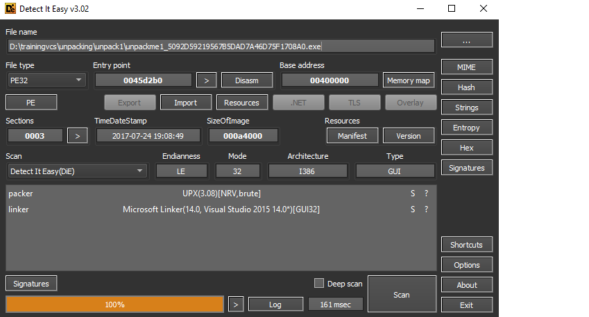

load file vào x64 để tiến hành quá trình debug ra oep 
theo tài liệu về OllyDbg_tut26 của anh `Kienmanowar` thì có những packer mà có lệnh đầu tiên thực thi là `pushad` thì có thể sử dụng `pushad method` để tìm oep

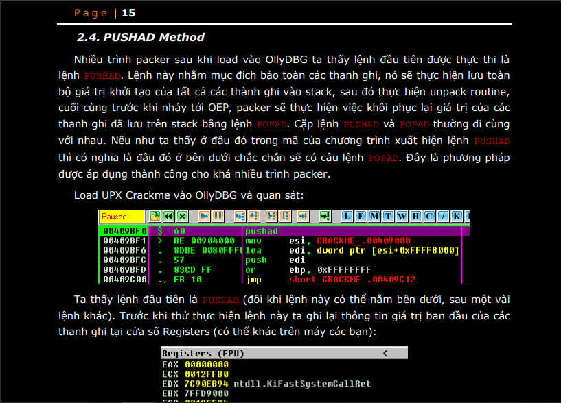

áp dụng kỹ thuật này để tìm ra oep của unpack1

đầu tiên trace qua lệnh `pushad` đầu tiên rồi đặt hardware breakpoint on access tại memory dump của `esp`
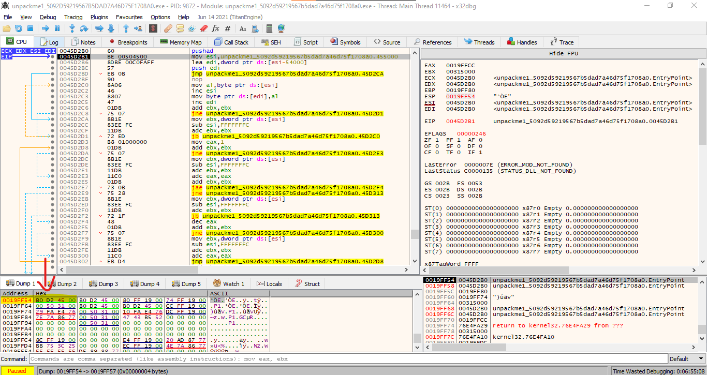

chạy chương trình thì sẽ thấy lệnh `popad` và bên dưới sẽ thấy một lệnh `jmp` khả năng là nhảy tới oep cần tìm 

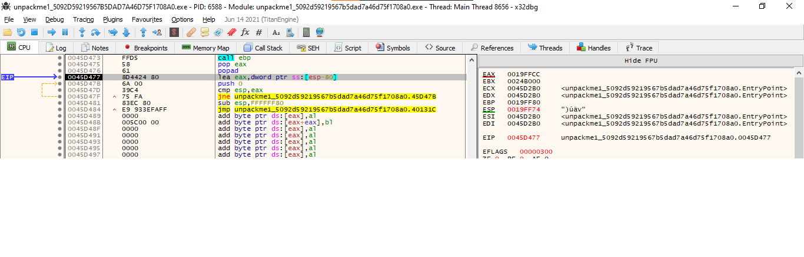

trace vào lệnh `jmp` và sử dụng scylla để dump ra, và để chạy được thì cần sử dụng cff explore để tắt aslr 

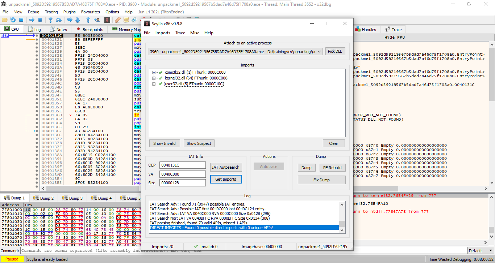

chương trình sau khi dump load vào ida đã detect được WinMain nên unpack đã thành công


## Unpack2
sử dụng detect it easy xem thông tin thấy unpack2 được pack bằng petie


áp dụng tương tự kỹ thuật `pushad` như unpack1 nhưng khi run thì sau trace vào lệnh `jmp` lại tới `VirtualFree`, tại đây tiếp tục trace chương trình, cuối cùng đã tới được oep

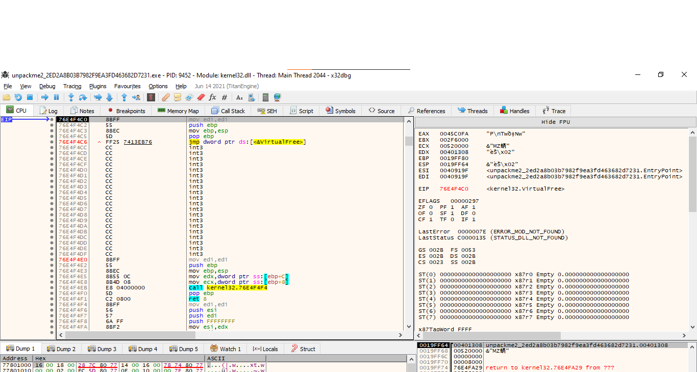

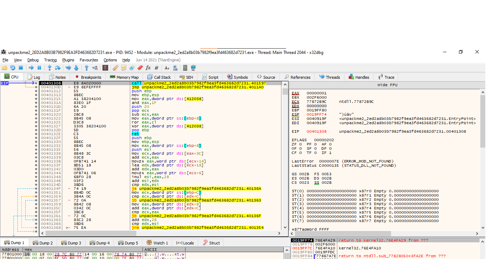

sử dụng scylla để dump ra nhưng có một số api không được scylla detect được, lý do là vì nhừng hàm này gọi bằng cách xoay bit và return vào địa chỉ của api chứ không gọi thẳng

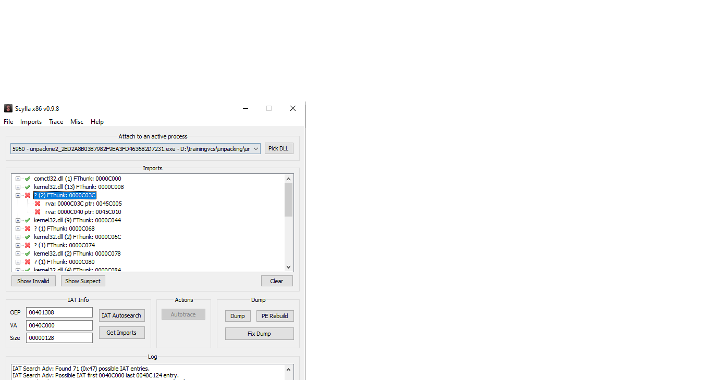

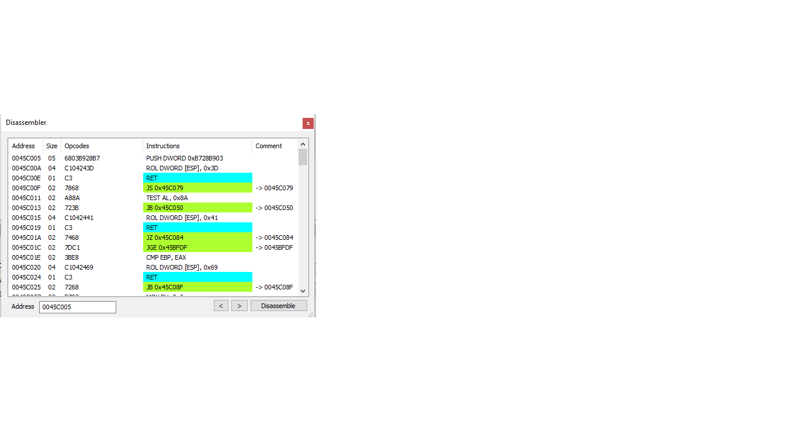

sửa lại bằng cách viết lại cách gọi địa chỉ của api những hàm này rồi chỉnh lại địa chỉ trong scylla bằng cơm
```
.386
.model flat, stdcall
option casemap:none

include C:\masm32\include\kernel32.inc
includelib C:\masm32\lib\kernel32.lib

include C:\masm32\include\masm32.inc
includelib C:\masm32\lib\masm32.lib

.code 

main proc
;0045C005
	push 0B728B903h
	rol dword ptr ss:[esp],3Dh

;0045C010
	push 3B728AA8h
	rol dword ptr ss:[esp],41h
	
;0045C01b
	push 0E83BC17Dh
	rol dword ptr ss:[esp],69h
	
;0045C026
	push 26F903B7h
	rol dword ptr ss:[esp],75h
 
;0045C031
	push 3B728570h
	rol dword ptr ss:[esp],81h

;0045C03c
	push 287183B7h
	rol dword ptr ss:[esp],95h
 
;0045C047
	push 726FC03Bh
	rol dword ptr ss:[esp],99h

;0045C052
	push 3B72A080h
	rol dword ptr ss:[esp],0A1h
	
;0045C05d
	push 3B728B2h
	rol dword ptr ss:[esp],0A5h

;0045C068
	push 297703B7h
	rol dword ptr ss:[esp],0B5h

;0045C073
	push 7298D03Bh
	rol dword ptr ss:[esp],0B9h

;0045C07e
	push 0B7298F83h
	rol dword ptr ss:[esp],0BDh
	
;0045C089
	push 0C83B7299h
	rol dword ptr ss:[esp],0E9h
	
;0045C094
	push 79C03B72h
	rol dword ptr ss:[esp],0F1h
	
;0045C09f
	push 3B729C58h
	rol dword ptr ss:[esp],1
	
;0040166d
main endp 
end

`code assembly này chỉ để debug tìm ra địa chỉ api chứ không chạy được`
```
nhưng tại `0040166d` thì chương trình dùng lệnh `ret` để nhảy tới api sử dụng nên không biết api sử dụng để fix lại, do đó chỉ có thể phân tích chương trình unpack chứ không chạy được


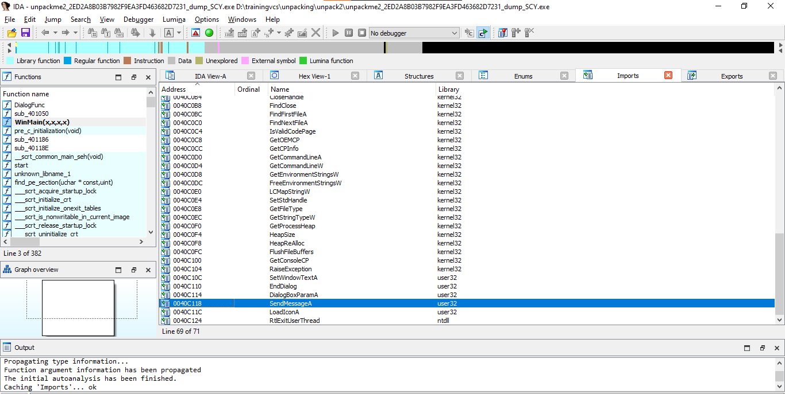


## Unpack3
sử dụng detect it easy xem thông tin thấy unpack3 được pack bằng aspack

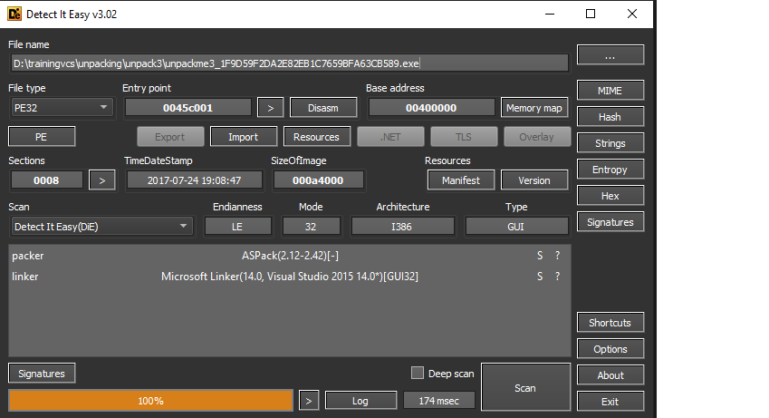

áp dụng tương tự kỹ thuật `pushad` là thấy được oep 

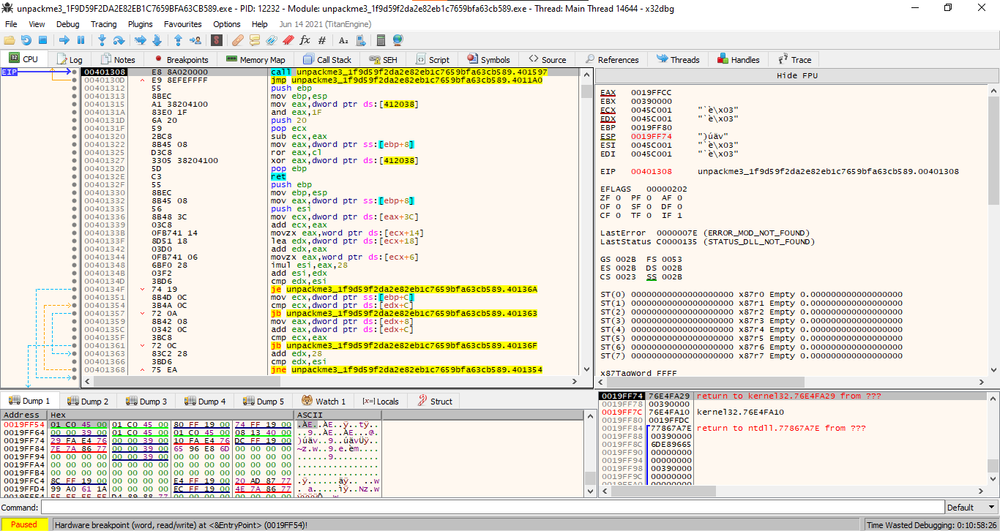

sử dụng scylla dunp ra là hoàn thành quá trình unpack 

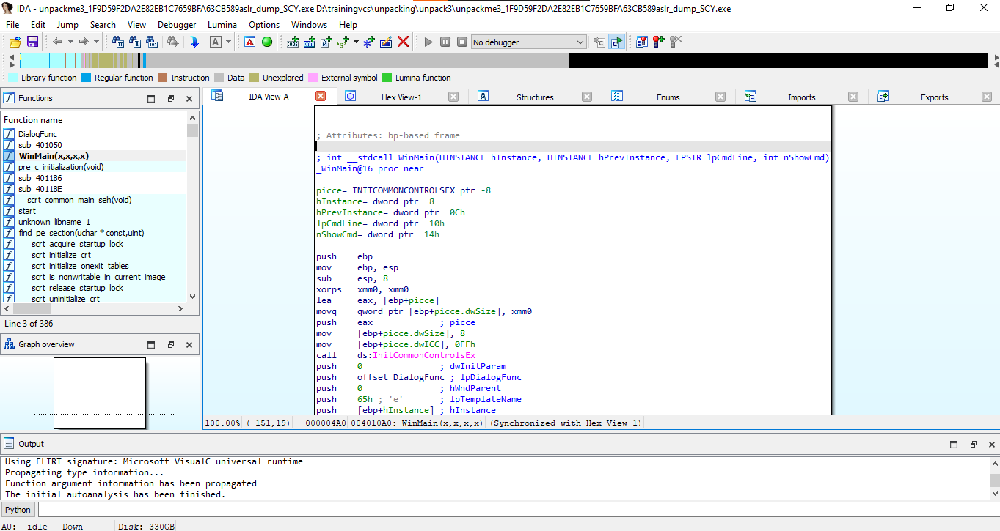


## unpack4


## unpack5 

sử dụng detect it easy xem thông tin thấy unpack5 được pack bằng MPRESS

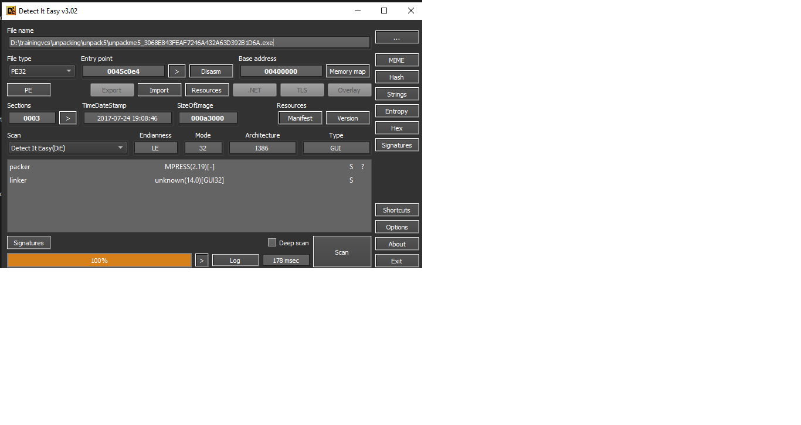

áp dụng tương tự kỹ thuật `pushad` là thấy được oep 

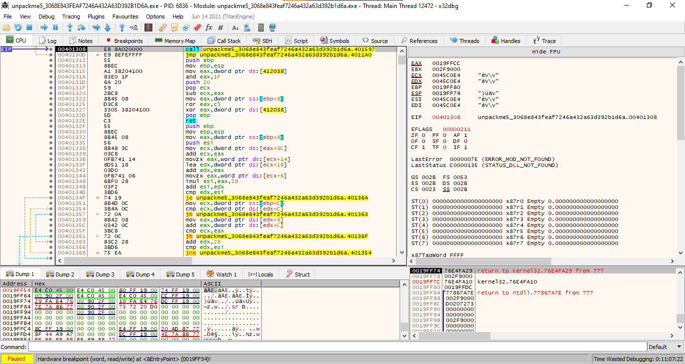

sử dụng scylla dunp ra là hoàn thành quá trình unpack 

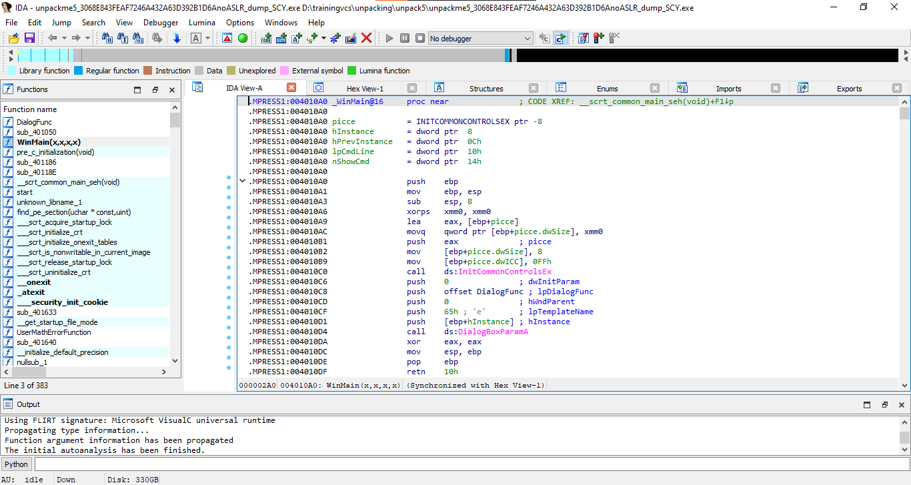


## unpack5 

sử dụng detect it easy xem thông tin thấy unpack5 được pack bằng VMProtect

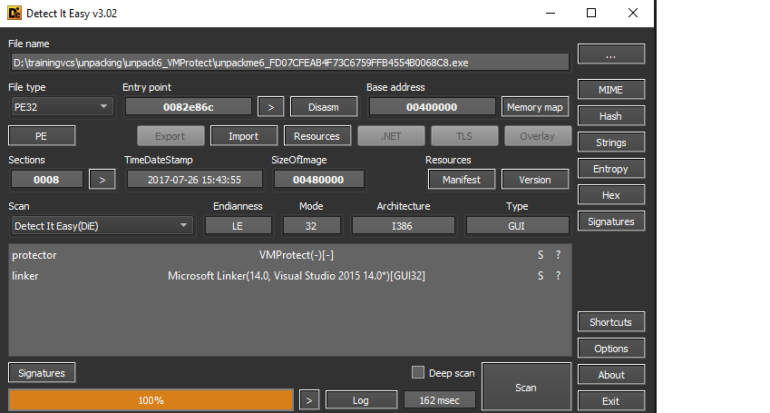

do entry point không có lệnh `pushad` nữa nên không thể sử dụng kỹ thuật này để tìm oep 

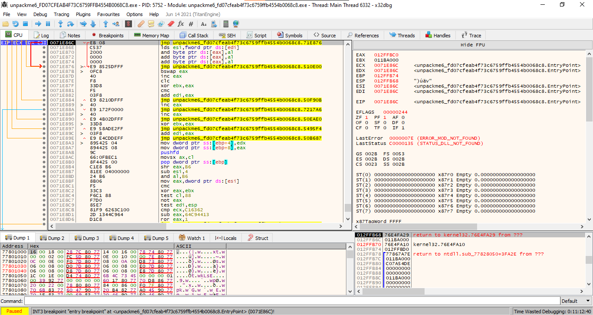

theo gợi ý của `Tuna99` thì có một trick để unpack đó là set breakpoint tại `VirtualProtect` và xem nó sẽ xét quền thực thi tại .code section lúc nào thì set lại quyền không cho thực thi ngay sau đó và thực hiện chạy chương trình, nếu chương trình bị dừng ở đâu thì rất có thể oep sẽ nằm trong đó

từ đây set breakpoint tại `VirtualProtect`


chạy 2 lần thì thấy ở đây `VirtualProtect` đang xét quyền `PAGE_EXECUTE_READWRITE = 0x40` cho section .text 

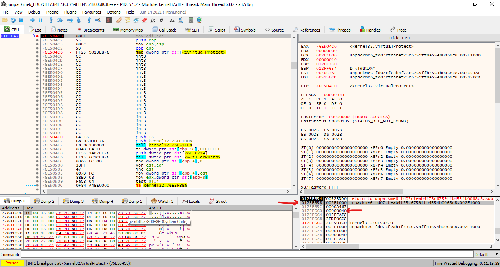

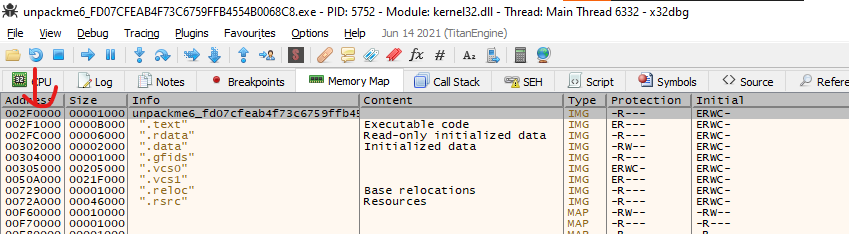

chạy đến khi `VirtualProtect` return thì set lại quyền cho .text section là `PAGE_READWRITE`

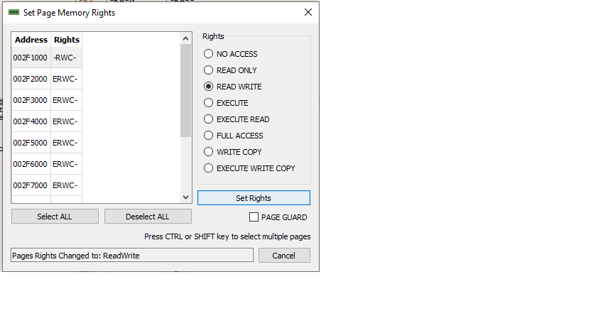

sau khi set xong quyền thì tắt breakpoint tại `VirtualProtect` và tiến hành chạy thêm 1 lần nữa
tại trạng thái này quan sát `string` thì thấy có chuỗi `"~~~ unpackme ~~~"` xuất hiện nên chứng tỏ chương trình đang bị dừng tại đoạn code thực thi 

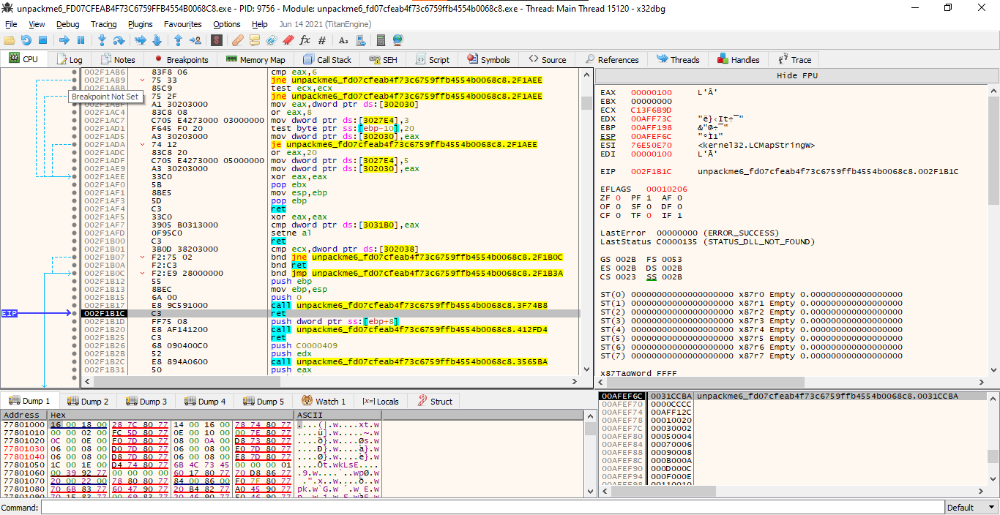

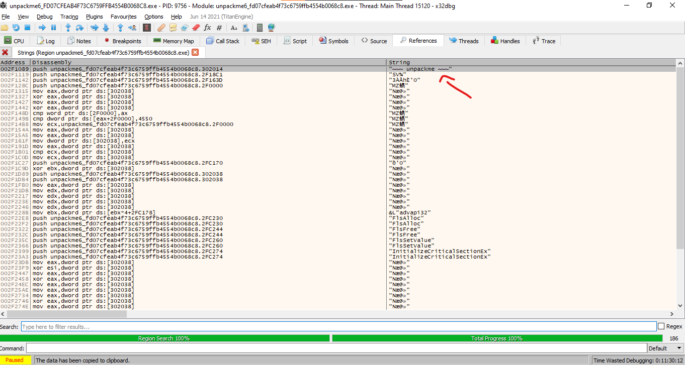

tuy tìm được đoạn code thực thi nhưng không thể tìm thấy oep nằm ở đâu vì IAT của chương trình đều bị sửa nên không thể thấy bất kỳ api nào để có thể đoán ra oep của chương trình nằm ở chỗ nào


## unpack7

sử dụng detect it easy để xem thông tin thấy unpack7 được pack bằng yoda-packer


